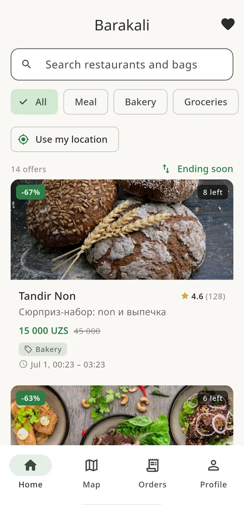
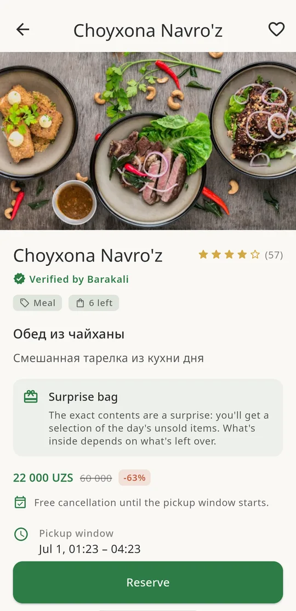
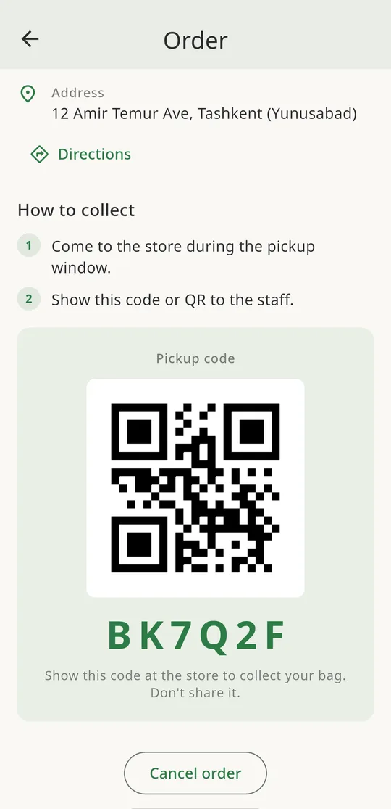

<div align="center">


### Surplus food marketplace for Uzbekistan

Rescue good, unsold food from restaurants, cafés, bakeries and supermarkets at a fraction of the price. Inspired by Too Good To Go, built for the Uzbek market.

[](#)
[](#)
[](#)
[](#)
[](#)

</div>

---

> ### ℹ️ About this repository
> **This repository holds the Barakali MVP client source:** the Flutter application for
> iOS, Android and Web, plus the public marketing site. The Supabase backend, database
> schema, RLS policies and Edge Functions are kept in a separate private repository.

---

## The problem

Every day, food businesses in Tashkent throw away perfectly good food they could not sell before closing, fresh bread, prepared meals, pastries, groceries near their sell-by date. Consumers, meanwhile, want good food at a lower price. Barakali connects the two: merchants list a discounted "surprise bag" of surplus food, consumers reserve and pay in the app, then pick it up.

Everyone wins: merchants recover revenue on food that would be wasted, consumers save money, and less food ends up in the bin.

## How it works

| Consumer | Merchant | Admin |
|---|---|---|
| Browse nearby surprise bags on a list or map | Register the business (self-service) | Approve / suspend merchants |
| Filter by category, distance, and dietary needs | Publish surplus offers (photo, price, pickup window) | Search orders and process refunds |
| Reserve and pay (Payme / Click) | Verify pickups by QR / code | View platform metrics |
| Pick up with a single-use code, then rate | See orders, net payout, and ratings | Handle support tickets |

## Highlights

- **Trilingual from day one** - Uzbek, Russian, English (Russian default), every string localized.
- **Dietary layer** - merchant-declared **halal** badge plus per-offer tags (vegetarian, vegan, no-pork, no-alcohol); a consumer standing preference that filters browsing **and** notifications.
- **Real-money reservations** - stock is locked atomically, amounts are recalculated server-side, pickup codes are single-use.
- **Maps & discovery** - Google Maps with clustered, branded price pins; nearest-first sorting.
- **Push notifications** - new-bag alerts for followed merchants, pickup reminders (localized, image-rich).
- **Privacy by design** - GDPR + Uzbekistan ZRU-547 aligned: explicit consent flow, data export, right-to-erasure.
- **Accessible & themed** - WCAG AA in both light and dark mode; a consistent, warm brand design system.

## Screenshots

_Screens from the running app._

<div align="center">

| Browse nearby bags | Offer detail | Pickup with QR code |
|:------------------:|:------------:|:-------------------:|
|  |  |  |

</div>

## Technology

**App (single codebase for iOS, Android, and Web)**
- **Flutter 3 / Dart 3**
- **Riverpod** for state management (manual Notifier / AsyncNotifier pattern)
- **go_router** for declarative routing and deep links
- **freezed** + **json_serializable** for immutable models
- **Google Maps**, **geolocator** for maps & location
- **qr_flutter** + **mobile_scanner** for pickup verification

**Backend (serverless)**
- **Supabase** - PostgreSQL with **Row Level Security on every table**, Auth, Storage, Realtime
- **Edge Functions** (Deno / TypeScript) for all payment and server-side logic
- **pg_cron** for scheduled lifecycle jobs (offer expiry, reminders)

**Integrations**
- **Payme** + **Click** - Uzbek payment providers (server-side only)
- **Eskiz.uz** - SMS OTP via a Supabase Auth hook
- **Firebase Cloud Messaging** - cross-platform push
- **Sentry** (crash reporting, EU data region) + **PostHog** (privacy-focused analytics)

**Engineering**
- **GitHub Actions** CI (format, static analysis, tests, release build on every push)
- Adversarial code review + live database security auditing as a mandatory quality gate
- Release-build obfuscation, OSV dependency scanning

## Architecture

Feature-first, clean-architecture layering with a strict one-way dependency flow. The presentation layer never touches the backend directly, it always goes through a provider and a repository.

```
Presentation  ->  Providers (Riverpod)  ->  Domain (models, interfaces)  ->  Data (repositories)
   widgets            business logic            immutable types              Supabase calls
```

Principles that shape the codebase:

- **Security lives on the server.** RLS on every table (tested with positive *and* negative cases), privileged columns pinned by database triggers, all payment amounts recalculated server-side, order mutations only through `SECURITY DEFINER` database functions, payment keys never in client code.
- **Immutable models,** typed end to end, no raw JSON leaking past the data layer.
- **Expected failures are values, not exceptions** (sold out, payment declined) via typed async states.
- **Every user-facing string is localized** (ru / uz / en) through ARB files.
- **A consistent design system** (spacing scale, brand palette, shared components) drives a coherent, accessible UI.

## Project structure

Feature-first modules keep each domain self-contained.

```
barakali/
├── lib/
│   ├── app/                 # MaterialApp, router, theme
│   ├── core/                # Shared: constants, l10n, models, theme, utils, widgets
│   └── features/            # Feature modules, each split presentation/providers/domain/data
│       ├── auth/            #   phone OTP, profiles, consent
│       ├── consumer/        #   browse, map, offer detail, favorites
│       ├── merchant/        #   registration, offers, orders, pickup verification
│       ├── orders/          #   reservation & order lifecycle
│       ├── payment/         #   Payme / Click checkout
│       ├── notifications/   #   FCM, preferences
│       ├── admin/           #   moderation, metrics, support
│       └── profile/         #   settings, dietary preferences, data export
│
├── marketing/               # Public marketing site (Astro + Tailwind)
├── test/                    # Unit & widget tests
└── .github/workflows/       # CI pipeline
```

The Supabase backend, versioned SQL migrations, RLS policies, database functions and triggers, and the Deno Edge Functions that handle payments, notifications and GDPR export/erasure, lives in a separate private repository.

## Roles & access control

Roles (`consumer`, `merchant`, `admin`) are stored server-side and enforced by Row Level Security on every table, never trusted from the client. Merchant approval, refunds, and platform operations run through admin-gated, audited database functions.

## Business model

A transparent, **fixed fee per surprise bag** (Too Good To Go style, not a percentage), deducted from the payment so a merchant never writes a cheque; the fee is invisible to consumers, and merchants see their net payout. An optional per-merchant override lets early partners start at zero and ramp up as demand builds.

## Compliance & privacy

Built for dual compliance from the start: **EU GDPR** and **Uzbekistan ZRU-547**.

- Explicit, versioned consent at registration (terms, privacy, cross-border transfer, optional marketing)
- Right to erasure (account deletion cascades and anonymizes personal data)
- Right to data portability (JSON export)
- Append-only consent and audit trails
- No sensitive biometric / genetic / telecom data collected

## Status

Pre-launch. Core marketplace is complete end to end, consumer discovery, reservations and payments, merchant tooling, admin operations, notifications, and the dietary layer. Remaining work before public launch is primarily legal and operational (business registration, payment-provider onboarding, regulatory clearances).

---

<div align="center">

**Barakali** · Surplus food, not wasted food · Tashkent, Uzbekistan

_Client source for the Barakali MVP. The Supabase backend is kept in a private repository._

</div>
